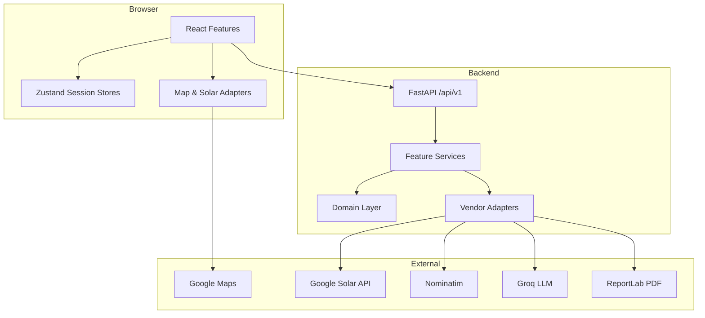

# Kahayag Energy — Technical & Conceptual Overview

**Document type:** Architecture and product reference  
**Audience:** Developers, stakeholders, hackathon judges, and future contributors  
**Last updated:** August 2026

---

## Table of Contents

1. [Executive Summary](#1-executive-summary)
2. [Conceptual Foundation](#2-conceptual-foundation)
3. [Problem and Solution](#3-problem-and-solution)
4. [Product Principles](#4-product-principles)
5. [Target Users](#5-target-users)
6. [User Journeys and Flows](#6-user-journeys-and-flows)
7. [Feature Overview](#7-feature-overview)
8. [Recommendation Framework](#8-recommendation-framework)
9. [Calculation Methodology](#9-calculation-methodology)
10. [System Architecture](#10-system-architecture)
11. [Frontend Architecture](#11-frontend-architecture)
12. [Backend Architecture](#12-backend-architecture)
13. [Domain Layer](#13-domain-layer)
14. [AI Strategy and Boundaries](#14-ai-strategy-and-boundaries)
15. [External Integrations](#15-external-integrations)
16. [Data Flow](#16-data-flow)
17. [State Management and Session Model](#17-state-management-and-session-model)
18. [API Reference](#18-api-reference)
19. [Deployment and Operations](#19-deployment-and-operations)
20. [Limitations and Professional Boundaries](#20-limitations-and-professional-boundaries)
21. [Future Vision](#21-future-vision)
22. [Related Documents](#22-related-documents)

---

## 1. Executive Summary

**Kahayag Energy** is a homeowner-facing solar pre-feasibility web application for residential properties in the Philippines. A homeowner locates their property on a satellite map, traces their usable roof area, describes their electricity use and optional budget, and receives a deterministic system recommendation with financial outcomes, an interactive panel layout, and a shareable contractor-ready PDF report.

The application does **not** replace an on-site assessment by a licensed solar professional. Its output is a preliminary feasibility estimate intended to help homeowners make a more informed decision before approaching contractors.

### What makes Kahayag different

| Dimension | Typical solar calculators | Kahayag Energy |
|-----------|--------------------------|----------------|
| Roof specificity | Generic or postcode-level | User-traced roof polygon on satellite imagery |
| Solar resource | National average only | Google Solar per-roof irradiance with nationwide fallback |
| Affordability | Often ignored | Budget is a first-class constraint alongside roof and demand |
| Numbers | Sometimes LLM-generated | **Domain computes; AI explains** — every figure is deterministic |
| Post-assessment | Static results | Design solver, quote audit, and AI design agent |
| Persistence | Accounts and saved projects | Session-only — no database, no accounts |

### Core architectural principle

> **The domain computes; AI explains.**

Every technical and financial number comes from `backend/app/domain/`. AI adapters may phrase those values in plain language, parse unstructured documents, or plan tool calls — but an agent must never move a calculation into a prompt, and never let a model output a number that was not computed deterministically.

---

## 2. Conceptual Foundation

### Vision

Enable any Filipino homeowner to answer four connected questions in under five minutes:

1. **Will panels physically fit on my roof?**
2. **How much electricity could they generate?**
3. **What system can I afford?**
4. **Would the investment be financially worthwhile?**

Existing tools often answer one of these in isolation. Kahayag balances **roof capacity**, **electricity demand**, and **budget** within one guided assessment, then extends into equipment design and installer quote comparison.

### Product type

- Responsive web application (React + FastAPI)
- Primary market: Philippines
- No user accounts, no database — assessment data lives in browser session state for the duration of a visit
- Grid-tied residential systems only (no off-grid or commercial sizing in MVP)

### MVP objective

Help a homeowner determine whether rooftop solar may be financially worthwhile and affordable for their property in under five minutes, with transparent assumptions and preliminary language throughout.

### Extended hackathon capabilities

Beyond the core PRD flow, the application adds:

- **Design workspace** — constraint solver picks real catalog equipment; interactive BOM canvas; AI design agent
- **Compare** — side-by-side build comparison and **Quote Truth Engine** (upload installer quote → forensic audit → visual diff)
- **Quotation** — generated quotation document from a selected build

These extensions follow the same principle: engineering numbers from the domain, AI for parsing and narration.

---

## 3. Problem and Solution

### The problem

Many Filipino homeowners are interested in rooftop solar but lack a simple, trustworthy way to determine whether it is appropriate and affordable for their specific home.

Common pain points:

- Generic calculators do not reflect the actual roof
- Contractor recommendations vary significantly
- Users do not understand system sizes, panel specifications, or how many panels fit
- Users do not know how much of their bill solar can offset or what a suitable system should cost
- Users contact contractors before understanding their own requirements, creating an information imbalance

### The solution

Kahayag provides a guided, property-specific pre-feasibility assessment that:

1. Grounds the estimate in the user's actual roof (traced polygon + satellite solar data where available)
2. Derives household demand from a monthly bill (no technical kWh entry required)
3. Treats budget as an optional but first-class constraint
4. Recommends one configuration with a clear explanation of the **limiting constraint**
5. Shows cost as a **range**, not a false-precision single price
6. Generates a contractor-ready PDF where AI writes prose but the application substitutes every number
7. Optionally audits uploaded installer quotes against the Kahayag benchmark

---

## 4. Product Principles

### 4.1 Affordability is a core constraint

The system must not recommend based only on maximum roof capacity. It considers roof capacity, electricity demand, and budget together.

### 4.2 Use cost ranges

Installation costs are shown as ranges (e.g. ₱220,000–₱270,000). A midpoint may drive internal payback math, but the range remains the primary user-facing value.

### 4.3 Explain uncertainty

Costs vary by contractor, equipment brand, roof condition, labor, permits, and electrical upgrades. The application states this explicitly.

### 4.4 Plain language

Technical terms are paired with familiar financial outcomes (e.g. "approximately 45% of your current monthly bill").

### 4.5 One primary recommendation

The application presents one configuration. Manual panel-count adjustment replaces the recommendation rather than sitting beside it, with updated explanation.

### 4.6 Avoid false precision

Appropriate: "approximately 5.7 years", "around 45% offset".  
Inappropriate: ₱243,782.19, 5.732 years, 44.83% offset.

### 4.7 Separate estimate from guarantee

Preliminary language throughout. The system never claims roof approval, guaranteed savings, guaranteed payback, or guaranteed pricing.

### 4.8 Transparency about data provenance

Where satellite solar data covers the property, generation uses measured sunlight for that roof. Where it does not, the calculation falls back to a nationwide peak-sun-hour assumption and records which source was used.

---

## 5. Target Users

### Primary user: Philippine homeowner considering rooftop solar

- Owns or helps manage a residential property
- Interested in lowering electricity expenses
- Limited or moderate solar knowledge
- Knows approximate monthly bill; may or may not know budget
- Wants an initial estimate before speaking with installers

### Secondary recipient: Solar contractor

Contractors may receive the generated PDF from the homeowner. The report presents property, roof, system, calculations, and assumptions consistently. There is no contractor portal in MVP.

---

## 6. User Journeys and Flows

### 6.1 Core assessment flow (PRD)

```
Landing → Locate property → Trace roof → Energy & budget → Plans → Loading → Results
```

| Step | Route | What happens |
|------|-------|--------------|
| Start | `/` | Value proposition, disclaimers, **Assess My Roof** |
| Locate | `/locate` | Address search or map pan; confirm property pin |
| Trace | `/trace` | Draw roof polygon on satellite imagery; area calculated |
| Energy | `/energy` | Monthly bill; optional budget or "estimate for me" |
| Plans | `/plans` | Optional goals/usage/timeline questionnaire |
| Loading | `/loading` | Submit assessment; fetch solar flux for panel layout |
| Results | `/results` | Recommendation, savings, payback, panel layout on map |

### 6.2 Extended exploration flow

```
Results → Design → Compare → Quotation → Permits
         ↓
    Edit layout (/results/layout)
         ↓
    Invest (/invest) → Why (/why) → Brief (/brief) → Report (/report)
```

| Step | Route | What happens |
|------|-------|--------------|
| Edit layout | `/results/layout` | Adjust panel count; live recalculation via API |
| Design | `/design` | Solver builds, BOM canvas, AI chat (Build/Ask modes) |
| Compare | `/compare` | Side-by-side builds; upload installer quote for audit |
| Quotation | `/quotation` | Download quotation for selected build |
| Invest | `/invest` | 25-year cumulative savings projection |
| Why | `/why` | Confidence breakdown and data provenance |
| Brief | `/brief` | Shareable project summary for contractors |
| Report | `/report` | AI-written PDF with value-preservation validation |

### 6.3 Quote audit flow

```
Compare → Upload quote (PDF/image/text) → OCR + extraction → Deterministic benchmark diff → Findings + diagram mapping
```

The homeowner uploads an installer quote. The backend extracts line items (OCR + AI parsing), compares against the active Kahayag build deterministically, and surfaces pricing/capacity mismatches and missing components.

---

## 7. Feature Overview

### 7.1 Property and roof selection

- Interactive Philippine map with satellite imagery (Google Maps)
- Address search via Nominatim (proxied through backend)
- Browser or IP-based approximate geolocation
- Polygon drawing with validation (self-intersection, minimum area, degenerate shapes)
- Usable roof area equals the traced area — no additional spacing derate applied server-side

### 7.2 Electricity and budget input

- Monthly bill in Philippine pesos (primary input)
- Optional direct kWh consumption or custom electricity rate
- Budget optional: **I have a budget** or **Estimate the budget for me**
- Live client-side preview (`liveEstimate.ts`) — labelled as estimate, mirrors domain constants, never persisted as authoritative

### 7.3 Assessment and recommendation

- Deterministic panel category, count, system size, generation, savings, payback
- Limiting constraint recorded (roof, demand, or budget)
- Budget compatibility and gap when budget is insufficient
- Location-specific solar resource via Google Solar with nationwide fallback
- Solar flux GeoTIFF overlay for optimized panel placement on results map

### 7.4 Results and financial outcomes

- Installation cost range (low / base / high per kWp scenarios)
- Monthly and annual savings capped at household consumption (no export credits in MVP subset)
- Payback from base-cost midpoint; null when savings are zero
- Shading summary when satellite data available
- Assumptions, cost inclusions/exclusions, and limitations visible

### 7.5 Investment projection

- 25-year cumulative savings vs upfront cost
- Panel degradation (0.5%/year) applied
- Electricity escalation held at 0% (today's pesos) in current implementation

### 7.6 Reports

- AI generates prose with **named placeholders only**
- Application substitutes validated values; malformed or unknown placeholders → deterministic template fallback
- ReportLab renders PDF locally
- Static map image (Esri World Imagery) embedded when Google key unavailable

### 7.7 Design workspace

- Bootstrap design session from completed assessment
- **Constraint solver** selects compatible panel/inverter/battery combinations from PH catalog
- Multiple solver goals: budget, backup, independence
- Interactive BOM diagram (`SystemCanvas`, `FullBomDiagram`)
- Component picker with catalog compatibility scoring
- AI design agent with tool loop (solver, mutate, explain, quote audit)
- Quotation document generation per build

### 7.8 Compare and quote audit

- Side-by-side overview and technical comparison of solver builds
- Quote Auditor: upload PDF, image, text, or CSV
- Pipeline: document read → OCR (Tesseract / Google Vision / Groq vision) → AI extraction → deterministic findings vs benchmark
- Quote diagram maps extracted line items to component slots for visual diff on canvas

---

## 8. Recommendation Framework

### Inputs

| Input | Purpose |
|-------|---------|
| Roof polygon / usable area | Maximum panel count |
| Monthly electricity bill | Estimated household demand |
| Available budget | Affordability constraint |
| Panel category | Wattage, dimensions, cost per kWp |
| Location solar resource | Generation estimate |

### Constraint resolution

Each constraint yields a maximum system size (or panel count). The recommendation takes the **minimum** of:

1. **Roof-limited** — floor(usable area ÷ panel area)
2. **Consumption-limited** — annual consumption ÷ annual yield per kWp
3. **Budget-limited** — available budget ÷ base cost per kWp (omitted budget → no constraint)

The constraint that produced the minimum is the **limiting constraint** and drives the user-facing explanation.

**Tie-breaking:** budget first, then demand, then roof — toward what the household controls most directly.

### Panel categories (MVP)

| Category | ID | Wattage | Dimensions | Trade-off |
|----------|-----|---------|------------|-----------|
| Standard | `standard-450` | 450 W | 1.13 × 1.76 m | Lower upfront cost; more roof area for same capacity |
| High-output | `high-output-550` | 550 W | 1.13 × 1.76 m | Higher capacity per panel; higher cost per kWp |

Both share the same footprint. Cost is derived per kilowatt-peak, not per panel.

### Adjustment rules

- Roof area and budget are **hard limits** on panel-count changes
- Exceeding estimated demand is **permitted** on manual adjustment; savings stay capped at consumption
- Recalculation uses the same deterministic rules as the original recommendation

---

## 9. Calculation Methodology

Authoritative specification: [`calculations_guide.md`](calculations_guide.md). Summary below.

### Key constants

| Parameter | Value | Notes |
|-----------|-------|-------|
| Default electricity rate | ₱12.00/kWh | Disclosed when user does not supply rate |
| Peak sun hours (fallback) | 5.0 h/day | Nationwide when Google Solar unavailable |
| Performance ratio | 0.80 | System losses (temp, inverter, wiring, soiling) |
| Cost per kWp (low / base / high) | ₱50k / ₱60k / ₱70k | Planning allowances, not regulated prices |
| Panel degradation | 0.5%/year | 25-year analysis horizon |
| Minimum system | 1 panel | Below budget → one-panel estimate + gap shown |

### Pipeline (simplified)

```
Bill → monthly kWh → annual consumption
Usable roof → roof-limited panel count → roof-limited kWp
Consumption → consumption-limited kWp
Budget → budget-limited kWp
preliminary kWp = min(roof, consumption, budget)
recommended panel count = floor(preliminary kWp × 1000 / panel wattage)
year-1 generation = kWp × peak sun hours × 365 × performance ratio
savings = min(generation, consumption) × electricity rate  [MVP: no export credits]
cost range = kWp × [low, high] cost per kWp
payback = base cost / year-1 savings  [null if savings ≤ 0]
```

### Cost scope

**Typical inclusions:** solar panels, inverter, standard installation  
**Potential exclusions:** roof repairs, electrical upgrades, permits  
**Outside estimate:** batteries (in primary MVP recommendation path), hybrid/off-grid, structural work, financing

---

## 10. System Architecture

### Repository layout

```
kahayag-1/
├── frontend/          React 19, Vite, Tailwind CSS v4, TypeScript (strict)
├── backend/           FastAPI, deterministic domain, feature orchestration
├── docs/              Product requirements, calculations, deployment, this document
└── scripts/           Project-level development commands
```

### High-level diagram



### Design decisions

| Decision | Rationale |
|----------|-----------|
| Split frontend/backend | Clear API boundary; domain testable without browser |
| Feature-first structure | Both apps organize by user capability, not technical layer |
| No database | MVP is session-only; reduces ops and privacy surface |
| Vendors behind adapters | Google, Nominatim, Groq replaceable without touching domain |
| Domain imports no framework | Solar rules portable and fully unit-testable |
| Keyed integrations default `disabled` | Stack boots and assesses with zero credentials |

---

## 11. Frontend Architecture

### Structure

```
frontend/src/
├── app/              Routes, global providers, router
├── features/         User-facing capabilities (one folder per feature)
├── shared/           UI components, API client, config, hooks, styles
├── integrations/     Map and solar provider adapters
└── state/            Zustand stores (assessment, design, flux cache)
```

### Features (by route)

| Feature | Route(s) | Responsibility |
|---------|----------|----------------|
| `landing` | `/` | Marketing entry |
| `property` | `/locate` | Address search, map pin |
| `roof` | `/trace` | Roof polygon tracing |
| `assessment` | `/energy`, `/plans` | Bill, budget, plans questionnaire |
| `loading` | `/loading` | Assessment submission, flux preload |
| `results` | `/results`, `/results/layout` | Outcomes, panel layout editor |
| `design` | `/design` | Solver builds, canvas, AI chat |
| `compare` | `/compare` | Build comparison, quote upload |
| `quotation` | `/quotation` | Quotation download |
| `recommendation` | `/invest`, `/why` | Projection, confidence |
| `reports` | `/brief`, `/report` | Brief and PDF report |
| `components-demo` | `/components` | Internal UI specimen |

### Design system

- Tokens in `frontend/src/shared/styles/index.css`
- Semantic rule: **yellow acts, cobalt informs, ember interrupts**
- Editorial type/spacing scale with 1.6× desktop multiplier at `min-width: 1024px`
- Shared components in `frontend/src/shared/components/ui/` — screens compose from these

### Client-side preview exception

`frontend/src/features/assessment/liveEstimate.ts` mirrors domain arithmetic for responsive form feedback. It is labelled as an estimate, never persisted or submitted as authoritative, and uses published domain constants.

---

## 12. Backend Architecture

### Structure

```
backend/app/
├── api/              Versioned FastAPI routes (/api/v1)
├── core/             Config, logging, error translation
├── domain/           Framework-free business rules
│   ├── solar/      Assessment math, geometry, recommendations
│   ├── design/     Catalog, solver, BOM, financials
│   └── shading/    Shading analysis normalization
├── features/         Use-case orchestration
│   ├── assessment/
│   ├── design/
│   ├── reports/
│   ├── shading/
│   ├── solar_flux/
│   └── geolocation/
├── integrations/     AI, geocoding, solar, PDF, quote parsing
└── shared/           Cross-feature concepts
```

### Request path (assessment)

```
Route → Feature router → Feature service → Domain rules → Response schema → Frontend
```

### Request path (report)

```
Report request → Validated assessment values → AI adapter (placeholders) or template
→ Value-preservation validation → ReportLab PDF → Download
```

---

## 13. Domain Layer

The domain is the single source of truth for all computed values.

### `domain/solar/`

| Module | Responsibility |
|--------|----------------|
| `assumptions.py` | Published constants (tariffs, costs, panel categories) |
| `calculations.py` | Demand, generation, savings, payback, cost range |
| `geometry.py` | Roof area → maximum panel capacity |
| `recommendations.py` | Panel count selection, limiting constraint, rationale |
| `projection.py` | Long-term investment projection |
| `resource.py` | Location-specific vs nationwide solar yield |
| `entities.py`, `value_objects.py` | Typed assessment entities |

### `domain/design/`

| Module | Responsibility |
|--------|----------------|
| `catalog.py` | Philippines solar components catalog |
| `solver.py` | Constraint solver — equipment combination picker |
| `compatibility.py` | Catalog compatibility for component picker |
| `bom.py` | Valid combo → bill of materials |
| `financials.py` | Build investment rollup from BOM |
| `scoring.py` | Fit-score ranking of valid combos |
| `mutations.py` | Constraint patches for user/agent changes |
| `rejection.py` | Solver rejection reason helpers |

### `domain/shading/`

Normalizes Google Solar building insights into shading summaries for results and reports.

---

## 14. AI Strategy and Boundaries

### What AI does

| Capability | AI role | Numbers from |
|------------|---------|--------------|
| PDF report narrative | Prose with placeholders | Domain (substituted by app) |
| Design agent | Tool planning, explanations | Domain via tool execution |
| Quote auditor | OCR assist, line-item extraction | Domain for benchmark comparison |
| Design explain | Plain-language design summary | Domain snapshot |

### What AI must never do

- Calculate panel count, kWp, savings, payback, or cost
- Output numbers not present in a validated payload
- Make structural, regulatory, or guaranteed-pricing claims

### Value preservation (reports)

The AI returns prose containing named placeholders (e.g. `{{monthly_savings_php}}`). The application substitutes validated values. Any unknown placeholder, unfilled placeholder, or malformed syntax → entire response discarded → deterministic template used.

### Provider configuration

| Setting | Options | Default |
|---------|---------|---------|
| `APP_AI_PROVIDER` | `groq`, `disabled` | `disabled` |
| `APP_SOLAR_PROVIDER` | `google`, `disabled` | `disabled` |
| `APP_QUOTE_OCR_PROVIDER` | `google_vision`, `groq` | `google_vision` |

With providers disabled, regex/templates and deterministic fallbacks keep the full flow functional.

### Agent architecture (design)

Target loop: **observe → act → revise**

```
User message → LLM plans tool call → Execute tool with real result
→ Feed result back → LLM replans or replies → Final response + reasoning steps
```

Tools include: run solver, mutate build, query catalog, get rejection reasons, explain, audit quote.

Reasoning steps are returned to the frontend for visible "how I decided" UI in `DesignChat`.

### Hackathon positioning

> *"Kahayag protects Filipino homeowners from bad solar quotes. Our engineering engine computes every number deterministically. AI handles what humans can't — reading messy installer PDFs, reasoning through design constraints when the solver rejects combinations, and generating negotiation scripts. The AI never invents a price."*

See [`hackathon_ai_strategy.md`](hackathon_ai_strategy.md) for demo script and execution plan.

---

## 15. External Integrations

| Integration | Purpose | Location | Keyed? |
|-------------|---------|----------|--------|
| **Google Maps** | Satellite basemap, drawing tools | Frontend script tag | Yes (referrer-restricted) |
| **Google Solar** | Building insights, flux/mask GeoTIFF | `integrations/solar/` | Yes (server-side) |
| **Nominatim** | Address geocoding | `integrations/geocoding/` | No (rate-limited, User-Agent required) |
| **ip-api.com** | Approximate IP geolocation | `integrations/geolocation/` | No |
| **Groq** | Report prose, design agent, quote extraction | `integrations/ai/` | Yes (server-side) |
| **Google Cloud Vision** | Quote image OCR | `integrations/quote_parsing/` | Optional |
| **Tesseract** | Offline OCR fallback | `integrations/quote_parsing/` | Local install |
| **ReportLab** | PDF rendering | `integrations/pdf/` | No |
| **Esri World Imagery** | Static map for PDF | `integrations/maps/` | No |

### Why Google Solar is accepted as a paid vendor

Panel-level irradiance and per-roof shading do not exist in any free source at the resolution this product needs. `buildingInsights:findClosest` supplies roof segments with pitch, azimuth, and sunshine hours; `dataLayers:get` supplies flux and mask rasters for shading summary and panel placement.

Coverage is uneven → nationwide peak-sun-hour fallback with provenance recorded.

---

## 16. Data Flow

### Assessment submission

```
RoofPage + AssessmentPage (session store)
  → POST /assessments
  → assessment/service.py
  → domain/solar (geometry, calculations, recommendations)
  → solar_resource lookup (Google or fallback)
  → CompletedAssessment response
  → assessmentStore + results UI
```

### Solar flux for panel layout

```
LoadingPage
  → POST /solar/flux/prepare (returns tokenized GeoTIFF URLs)
  → GET /solar/flux/geotiff/{layer}/{token} (proxied bytes)
  → fluxCacheStore
  → Results map: flux sampler optimizes panel positions inside polygon
```

### Design session

```
Results → POST /designs/bootstrap
  → solver produces initial builds (budget, backup, independence)
  → designStore
  → /design: canvas, chat agent, mutations via POST /designs/mutate
```

### Quote audit

```
ComparePage upload
  → POST /designs/quote-audit (multipart)
  → document_reader → OCR → quote_auditor extraction
  → quote_audit.py deterministic findings vs active build
  → quote_diagram.py component slot mapping
  → designStore.quoteAuditResult → Compare + Design canvas diff
```

---

## 17. State Management and Session Model

### Stores (Zustand)

| Store | Persistence | Contents |
|-------|-------------|----------|
| `assessmentStore` | `sessionStorage` (result excluded) | Property, roof polygon, energy inputs, plans, contact, assessment result |
| `designStore` | In-memory | Design session, selected build, quote audit result |
| `fluxCacheStore` | In-memory | GeoTIFF rasters for panel layout |

### Session behavior

- No authentication required
- Data lost on refresh, tab close, or session expiration
- User encouraged to download PDF before leaving
- Property change resets design store

### API caching

React Query handles mutations and cache invalidation in feature hooks (e.g. panel-count adjustment, investment projection recompute).

---

## 18. API Reference

Base path: **`/api/v1`**

### Core

| Method | Path | Description |
|--------|------|-------------|
| GET | `/health` | Liveness check |
| GET | `/properties/search` | Address search (Nominatim) |
| POST | `/geolocation/approximate` | IP-based approximate location |

### Assessment

| Method | Path | Description |
|--------|------|-------------|
| POST | `/assessments` | Full solar pre-feasibility assessment |
| POST | `/assessments/investment-projection` | Recompute long-term projection |
| POST | `/assessments/panel-count-adjustment` | Adjust panel count and recompute |

### Solar and shading

| Method | Path | Description |
|--------|------|-------------|
| POST | `/shading/analyze` | Google Solar shading analysis |
| POST | `/solar/flux/prepare` | Prepare GeoTIFF proxy URLs |
| GET | `/solar/flux/geotiff/{layer}/{token}` | Proxy GeoTIFF bytes |

### Reports

| Method | Path | Description |
|--------|------|-------------|
| POST | `/reports/pdf` | Generate PDF report |

### Design

| Method | Path | Description |
|--------|------|-------------|
| POST | `/designs/bootstrap` | Bootstrap design session from assessment |
| POST | `/designs/optimise` | Re-solve for solver goal |
| POST | `/designs/mutate` | Apply constraint patch / component swap |
| POST | `/designs/catalog-options` | Compatible catalog options for picker |
| GET | `/designs/solves/{solve_id}/rejections` | Solver rejection reasons |
| POST | `/designs/quotation/{build_id}` | Generate quotation document |
| POST | `/designs/agent` | AI design agent turn |
| POST | `/designs/explain` | AI explanation of design snapshot |
| POST | `/designs/quote-audit` | Upload and audit installer quote |

---

## 19. Deployment and Operations

### Hosting

Both applications deploy to **Vercel** as separate projects, triggered by `.github/workflows/deploy.yml` on push to `main`.

| App | Runtime | Entry |
|-----|---------|-------|
| Backend | `@vercel/python` | `backend/app/main.py` |
| Frontend | Vite static build | `frontend/` |

### Required configuration

**Backend (`backend/.env`):**

- `APP_ENV`, `APP_CORS_ORIGINS`
- `APP_AI_PROVIDER`, `APP_GROQ_API_KEY` (optional)
- `APP_SOLAR_PROVIDER`, `APP_GOOGLE_SOLAR_API_KEY` (optional)
- `APP_NOMINATIM_USER_AGENT` (production)

**Frontend (`frontend/.env`):**

- `VITE_API_BASE_URL` — absolute URL including scheme and `/api/v1` suffix; build fails if missing

### Verification commands

```bash
# Backend
cd backend && .venv/bin/python -m pytest && .venv/bin/ruff check .

# Frontend
cd frontend && npm run typecheck && npm run lint && npm test
```

See [`DEPLOYMENT.md`](DEPLOYMENT.md) for post-deploy smoke checklist.

---

## 20. Limitations and Professional Boundaries

Kahayag provides a **preliminary desktop estimate**. It does not include or replace:

- On-site structural inspection or roof-condition assessment
- Measured shading survey or professional tilt/azimuth analysis
- Final panel layout, mounting design, or wind-loading design
- Inverter/string design, electrical diagrams, or interconnection study
- Permits, taxes, net-metering eligibility, or export-credit confirmation
- Financing, maintenance, or battery dispatch simulation (in MVP primary path)
- Guaranteed performance, savings, payback, or contractor pricing

Every report states:

> This result is a preliminary pre-feasibility estimate based on simplified inputs and configurable planning assumptions. A licensed solar professional must verify the property, roof, electrical system, equipment design, permits, utility requirements, and final quotation before purchase or installation.

### MVP non-goals (selected)

- User accounts and assessment history
- Live contractor quotations or contractor recommendations
- Specific brand/model recommendations
- Commercial or industrial systems
- Payment processing or financing applications
- Post-installation performance tracking

---

## 21. Future Vision

The PRD and broader technical proposal describe a production system beyond the hackathon MVP:

- Philippine-specific solar datasets and geospatial processing at scale
- Machine-learning yield prediction trained on local conditions
- Net-metering export credit modeling with distribution-utility-specific rates
- Battery dispatch simulation and hybrid system design
- Contractor marketplace or quotation comparison at scale
- Persistent projects and homeowner accounts (if product direction changes)

The current architecture preserves extension points: domain rules stay framework-free, vendors stay behind adapters, and AI remains narratively bounded so new calculation capabilities can be added to the domain without retraining prompts.

---

## 22. Related Documents

| Document | Purpose |
|----------|---------|
| [`Kahayag PRD.md`](Kahayag%20PRD.md) | Full product requirements, user stories, acceptance criteria |
| [`calculations_guide.md`](calculations_guide.md) | Authoritative formulas, constants, rounding rules |
| [`hackathon_ai_strategy.md`](hackathon_ai_strategy.md) | AI demo strategy, agent loop, quote truth engine |
| [`DEVELOPER_GUIDE.md`](../DEVELOPER_GUIDE.md) | Repository navigation, vendor choices, data flow |
| [`DEPLOYMENT.md`](DEPLOYMENT.md) | Post-deploy smoke checklist |
| [`SETUP.md`](../SETUP.md) | Local development setup |
| [`AGENTS.md`](../AGENTS.md) | Instructions for AI coding agents |

---

*Kahayag Energy — helping Filipino homeowners see whether solar fits their roof, their bill, and their budget, before they talk to a contractor.*
